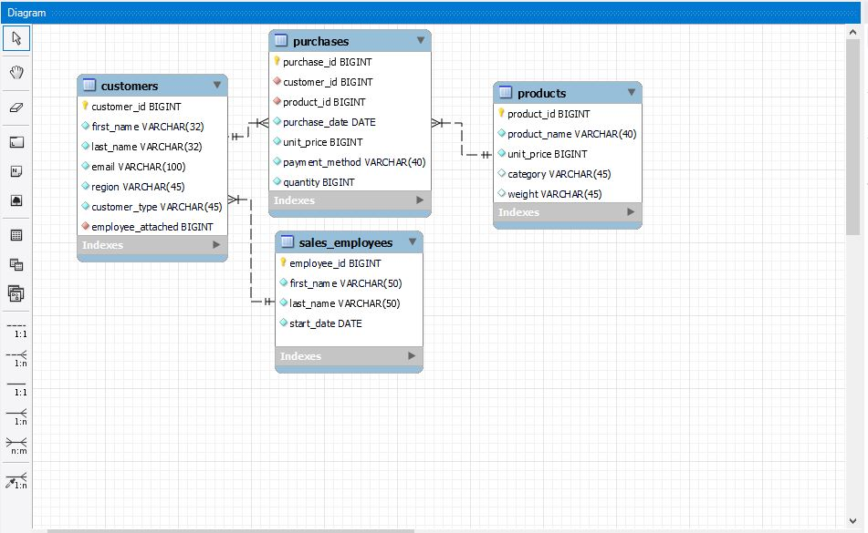
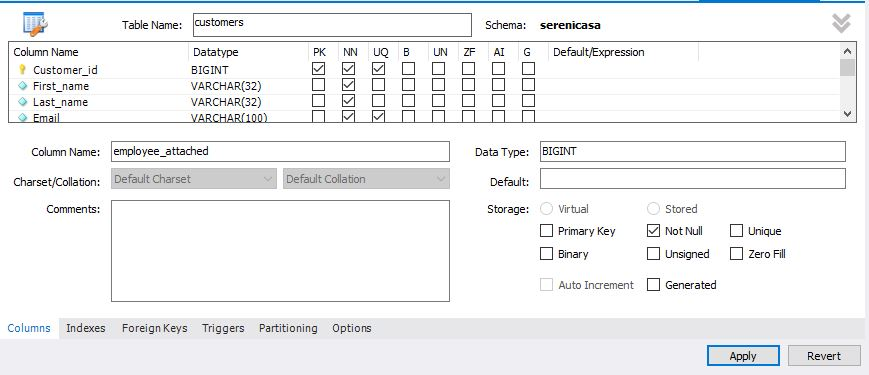

# Database-Design-with-MYSQL-Workbench
## Intro
A new client "the owner of SereniCasa" recently contacted me with a request to develop a comprehensive database from scratch. This database will be designed to encompass and manage data related to customers, purchase orders, and employees for their business.

## Approach

I have attached the [script](https://github.com/Tori-Greg/Database-Design-with-MYSQL-Workbench/blob/main/SQL%20SCRIPT%20Database%20Design.sql) that I utilized for this project, but I'd like to highlight a couple of points:
- EER Diagram: The initial phase of the design process involved crafting an Entity-Relationship (EER) diagram to visually depict the interconnections among the tables within the dataset. This task was accomplished using the EER Editor within MySQL Workbench. During this stage, primary keys were established, and the relevant foreign keys were linked to these primary keys to establish the table relationships.
  
  

 - Constraints: To uphold data integrity and adhere to best practices, I implemented both null and unique constraints on specific columns within the dataset, and this was accomplished through the user-friendly interface provided by Workbench. The unique constraint was primarily employed on primary keys to prevent the duplication of values, while the null constraint was utilized to ensure that cells within our tables could not remain empty.

- Data Normalization: To achieve data normalization, I initially employed Excel and subsequently imported the normalized data into Workbench through the import wizard. 
- User Privileges and Constraints: The configuration of user privileges and constraints was handled through the MySQL interface rather than by writing custom code.
